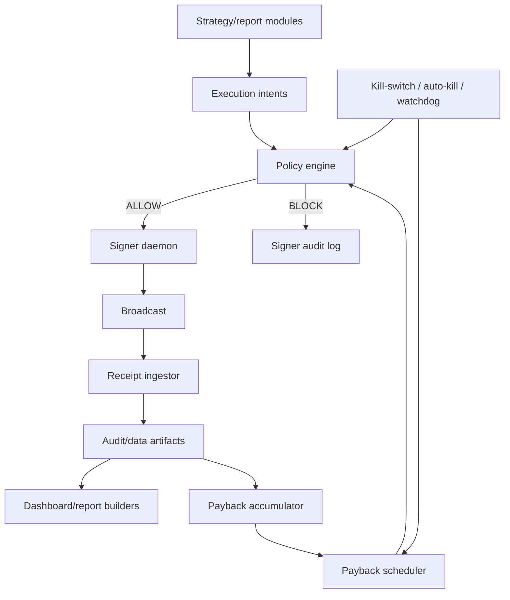

# BOB Claw System Map

This is the canonical engineering map for BOB Claw. It exists to keep coding
agents, dashboard work, and future feature work aligned with the actual system
instead of old snapshots or generated status files.

## Operating Law

- `AGENTS.md` is the operating law. If any doc, report, dashboard copy, or
  memory file disagrees with `AGENTS.md`, `AGENTS.md` wins.
- Product model: native BTC enters from the operator wallet, is deployed into
  destination-chain strategies, and realized positive PnL funds deterministic
  native-BTC payback.
- Accounting is BTC/sats first. USD is display and policy projection only.
- Runtime execution is deterministic. Coding-session LLMs may edit code,
  configs, docs, and run operator-requested commands, but policy code decides
  approval and signer daemons hold keys.
- Caps are committed config under `src/config/`, not env vars or dashboard
  runtime state.
- Gateway destinations are exactly the 11 chains in
  `src/config/gateway-destinations.mjs`: Ethereum, BOB, Base, BSC, Avalanche,
  Unichain, Berachain, Optimism, Soneium, Sei, and Sonic. Bitcoin is the
  native on/offramp side. Arbitrum and Polygon are fallback/manual bridge
  surfaces only, not Gateway destinations.

## Runtime Architecture

| Layer | Primary Files | Responsibility | Must Not Do |
| --- | --- | --- | --- |
| Operating law | `AGENTS.md` | Product rules, safety invariants, current overrides | Store volatile status |
| Config | `src/config/*.mjs` | Caps, chains, policy thresholds, protocol bindings | Read keys or audit logs |
| Strategy evidence | `src/strategy/**/*.mjs` | Build candidates, reports, adapters, evidence surfaces | Sign or decide runtime approval |
| Capital manager | `src/executor/capital/*.mjs` | Build target balances, refill/drain plans | Raise caps at runtime |
| Policy | `src/executor/policy/*.mjs`, `src/risk/*.mjs` | Pure approval and halt gates | Hold keys |
| Signer | `src/executor/signer/*.mjs` | Local socket, key-backed signing, audit append | Bypass policy |
| Receipt ingestion | `src/executor/ingestor/*.mjs`, `src/ledger/*.mjs` | Receipt normalization and reconciliation | Rewrite audit history |
| Payback | `src/executor/payback/*.mjs` | Sats-first accumulator, scheduler, payback dashboard slice | Choose ratio/timing by LLM |
| Dashboard | `src/status/*.mjs`, `src/dashboard/*.mjs`, `dashboard/public/*.jsx` | Read-only public slices and visual UI | Execute trades or hold secrets |

## Strategy Lanes

| Lane | Representative Modules | Current Purpose | Admission Evidence |
| --- | --- | --- | --- |
| Gateway wrapped-BTC loops | `strategy-catalog`, `btc-proxy-spreads`, Gateway helpers | Transport and wrapped-BTC route measurement | Quote, fee, latency, execution, receipt |
| Destination BTC yield/lending | `destination-*`, `wrapped-btc-*`, `recursive-*`, Moonwell helpers | Evidence-primary and official-destination yield surfaces | Unwind path, HF/liquidation policy, receipt-backed cost |
| Campaign/Merkl/radar canaries | `merkl-*`, `strategy/radar/*`, `config/sizing.mjs` | Tiny live canary discovery and queueing | EV helper, reward haircut, exit liquidity proof, tiny cap |
| Stable loops and reserve sleeves | `stable-*`, `tokenized-reserve-*`, treasury rotation | Stable entry/exit and deterministic yield sleeves | Realized net after gas, claim/swap, bridge/exit cost |
| ETH-family deployment | `ethereum-route-*`, mixed triangle/flash modules | Allowed when measured positive EV clears fees | Ethereum gas/slippage and unwind proof |
| Payback lane | `executor/payback/*`, Gateway BTC offramp helpers | Convert realized positive PnL share to native BTC | Three-way settlement proof: source tx, Gateway order, BTC txid |

Important distinction: reporting, shadow, prelive, and plan files can rank or
describe a lane, but they do not authorize signing. Runtime approval still
requires committed caps, policy approval, signer isolation, kill-switch checks,
and receipt/audit behavior.

Route remediation autopilot (`src/strategy/route-remediation-autopilot.mjs`,
`npm run report:route-remediation-autopilot`) is dev-lane only. It consumes
blocked strategy/campaign candidates and emits code work orders after
overfit, official-Gateway-scope, cost-variance, and no-runtime-authority
checks. Its output is a committed-diff planning surface, not a live execution
approval.

## Config And Policy Owners

| Concern | Canonical Owner | Notes |
| --- | --- | --- |
| Official Gateway chains | `src/config/gateway-destinations.mjs` | Import this instead of copying arrays |
| Route remediation planning | `src/strategy/route-remediation-autopilot.mjs` | Work orders only; no signer, cap, daemon, or runtime mutation authority |
| Strategy caps | `src/config/strategy-caps.mjs` API, `src/config/strategy-caps/registry.mjs` data | Public imports stay on `strategy-caps.mjs` |
| Tiny-canary EV sizing | `src/config/sizing.mjs` | Shared by radar preview, Merkl sync, executor policy |
| Small-capital campaign rules | `src/config/small-capital-campaign-mode.mjs` | Evidence-led primary-chain two-lane policy |
| Gateway pause | `src/config/gateway.mjs`, `src/executor/policy/gateway-availability.mjs` | Signer policy is a backstop |
| Auto-kill | `src/config/auto-kill.mjs`, `src/risk/auto-kill-triggers.mjs` | Writes kill-switch and audit record |
| Payback policy | `src/config/payback.mjs` | Ratio, min, caps, schedule, emergency pauses |
| Concentration | `src/config/diversification.mjs`, `src/executor/risk/concentration-guard.mjs` | Keep units explicit when refactoring |

## Data And Audit Surfaces

| Path | Kind | Git Policy | Cleanup Policy |
| --- | --- | --- | --- |
| `logs/signer-audit.jsonl` | Append-only execution audit | Ignored | Never delete, rewrite, or rotate in place |
| `logs/kill-switch-audit.jsonl` | Append-only halt/resume audit | Ignored | Never delete during cleanup |
| `logs/dev-lock-audit.jsonl` | Append-only dev-lock audit | Ignored | Never delete during cleanup |
| `data/*.jsonl` | Observations, receipts, runs, failures | Ignored | Operational history; not trash by default |
| `data/*latest.json`, `data/*.json` | Local report/cache artifacts | Ignored | Regenerable unless used as receipt/evidence source |
| `dashboard/public/*.json` | Public-safe generated slices | Some tracked legacy snapshots | Do not stage with source refactors unless intentionally publishing |
| `src/graphify-out/*`, `graphify-out/*` | Graph navigation artifacts | Ignored | Regenerable, but useful for LLM navigation |

## Dashboard Generation

Source-like dashboard files:

- `dashboard/public/*.jsx`
- `dashboard/public/index.html`
- `dashboard/public/_headers`
- `src/status/*.mjs`
- `src/dashboard/*.mjs`

Generated dashboard files:

- `dashboard/public/*.js`
- `dashboard/public/dashboard-status.json`
- `dashboard/public/live-runtime.json`
- `dashboard/public/auto-kill-events.json`
- `dashboard/public/strategy-tick-status.json`
- `dashboard/public/wallet-holdings.json`
- `dashboard/public/merkl-active.json`

Generation commands:

- `npm run dashboard:build`
- `npm run status:dashboard`
- `npm run report:wallet-holdings-slice -- --json --write`
- `npm run report:strategy-tick-slice -- --json --write`
- `npm run risk:auto-kill-check:json` plus `report-auto-kill-events` through the live dashboard loop

`dashboard/public/live-runtime.json` controls whether the browser prefers a
remote live origin. Treat changes to it as deployment behavior, not cosmetic
status refresh.

## Known Historical Contradictions

- `docs/strategy-system-map-2026-04-15.md` is a historical snapshot. It says
  live trading was blocked and describes an older active canary. Do not use it
  as current policy.
- Dated prelive and plan docs can describe build order, not runtime phase
  gates. AGENTS.md forbids tiered manual promotion gates for live execution.
- Older dashboard plans may say the dashboard reads only one JSON file. Current
  live overlay code also reads focused slices for wallet holdings, strategy
  ticks, Merkl activity, live runtime, and auto-kill events.
- Arbitrum/Polygon references in bridge or Merkl code are non-Gateway fallback
  surfaces unless a committed operating-law diff says otherwise.

## Change Checklist For Future Agents

Before changing strategy, policy, payback, dashboard, or generated artifacts:

1. Read `AGENTS.md`, this file, and `docs/harness-engineering.md`.
2. Run `git status --short --branch` and identify generated dirty files.
3. Use `rg` to find existing modules and imports before adding files.
4. Keep public imports stable when splitting large modules.
5. Add targeted tests for any safety/policy behavior change.
6. Run the relevant targeted command, then `npm run check` and `npm test`
   before committing.
7. Stage exact source/docs/test files only; leave generated dashboard JSON
   unstaged unless the task is explicitly a dashboard snapshot publish.
