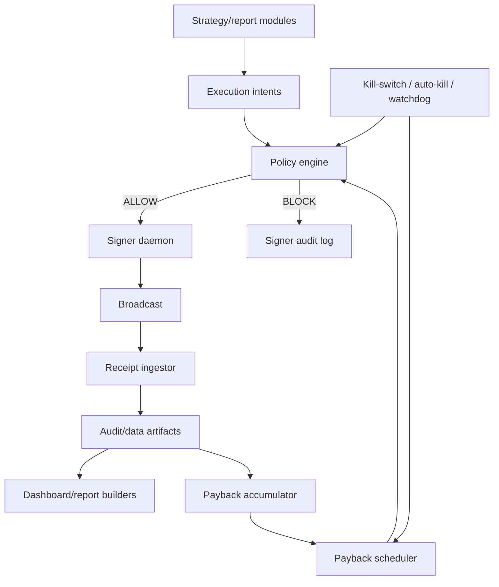

# BOB Claw System Map

This is the canonical engineering map for BOB Claw. It exists to keep coding
agents, dashboard work, and future feature work aligned with the actual system
instead of old snapshots or generated status files.

## Operating Law

- `AGENTS.md` is the operating law. If any doc, report, dashboard copy, or
  memory file disagrees with `AGENTS.md`, `AGENTS.md` wins.
- Product model: native BTC enters from the operator wallet, is deployed into
  destination-chain strategies, and realized positive PnL funds deterministic
  native-BTC payback.
- Accounting is BTC/sats first. USD is display and policy projection only.
- Runtime execution is deterministic. Coding-session LLMs may edit code,
  configs, docs, and run operator-requested commands, but policy code decides
  approval and signer daemons hold keys.
- Caps are committed config under `src/config/`, not env vars or dashboard
  runtime state.
- Gateway destinations are exactly the 11 chains in
  `src/config/gateway-destinations.mjs`: Ethereum, BOB, Base, BSC, Avalanche,
  Unichain, Berachain, Optimism, Soneium, Sei, and Sonic. Bitcoin is the
  native on/offramp side. Arbitrum and Polygon are fallback/manual bridge
  surfaces only, not Gateway destinations.

## Runtime Architecture

| Layer | Primary Files | Responsibility | Must Not Do |
| --- | --- | --- | --- |
| Operating law | `AGENTS.md` | Product rules, safety invariants, current overrides | Store volatile status |
| Config | `src/config/*.mjs` | Caps, chains, policy thresholds, protocol bindings | Read keys or audit logs |
| Strategy evidence | `src/strategy/**/*.mjs` | Build candidates, reports, adapters, evidence surfaces | Sign or decide runtime approval |
| Capital manager | `src/executor/capital/*.mjs` | Build target balances, refill/drain plans | Raise caps at runtime |
| Policy | `src/executor/policy/*.mjs`, `src/risk/*.mjs` | Pure approval and halt gates | Hold keys |
| Signer | `src/executor/signer/*.mjs` | Local socket, key-backed signing, audit append | Bypass policy |
| Receipt ingestion | `src/executor/ingestor/*.mjs`, `src/ledger/*.mjs` | Receipt normalization and reconciliation | Rewrite audit history |
| Payback | `src/executor/payback/*.mjs` | Sats-first accumulator, scheduler, payback dashboard slice | Choose ratio/timing by LLM |
| Dashboard | `src/status/*.mjs`, `src/dashboard/*.mjs`, `dashboard/public/*.jsx` | Read-only public slices and visual UI | Execute trades or hold secrets |

## Runtime Automation Map

These are runtime services or long-running automation surfaces. Some are
execution-capable, but none may bypass committed caps, policy, signer approval,
the kill-switch, or append-only audit.

| Runtime Surface | Primary Files / Commands | Function | Verification Handle |
| --- | --- | --- | --- |
| Signer daemon | `src/executor/signer/daemon.mjs`, `npm run executor:daemon`, `npm run ops:launchd:status` | Holds EVM/BTC keys, checks policy, signs/broadcasts, writes signer audit | `readSignerHealth()`, `state/executor-heartbeat.json`, `logs/signer-audit.jsonl` |
| Watchdog and auto-kill | `src/executor/watchdog/*`, `src/risk/auto-kill-triggers.mjs`, `npm run executor:watchdog:once`, `npm run risk:auto-kill-check:json` | Detects stale signer heartbeat and systemic loss/failure/oracle/campaign/protocol hazards | `logs/kill-switch-audit.jsonl`, `dashboard/public/auto-kill-events.json` |
| Live all-chain autopilot | `src/cli/run-all-chain-autopilot.mjs`, `npm run executor:all-chain-autopilot:loop`, `npm run live:automation:launchd:status` | Runs refresh, refill planning, canary/portfolio orchestration, strategy dispatch, payback, auto-kill slice | `data/all-chain-autopilot-latest.json`, `data/all-chain-autopilot-runs.jsonl` |
| Gate self-heal | `src/cli/run-gate-self-heal.mjs` | Refreshes stuck gate/report inputs and keeps advisory evidence moving | `data/*latest.json`, automation health report |
| Strategy evidence refresh | `src/cli/run-strategy-evidence-refresh.mjs`, `npm run auto:strategy-evidence:launchd:status` | Periodically refreshes strategy evidence, auto-research summaries, promotion/dev artifacts | `data/strategy-evidence-refresh-latest.json` |
| Dashboard public live | `src/cli/run-dashboard-public-live.mjs`, `src/cli/deploy-dashboard-public-live.mjs` | Builds and serves read-only public slices | `dashboard/public/*.json`, `npm run dashboard:build` |
| Research automation | `research/*`, `src/cli/run-auto-research-refresh.mjs`, `npm run research:launchd:status` | Generates research hypotheses and dev-lane candidate artifacts only | `data/auto-research-refresh-latest.json`, `logs/auto-research-audit.jsonl` |

## Functional Owners

| System | Function |
| --- | --- |
| Operating law and maps | `AGENTS.md` defines product, risk, LLM, payback, and runtime authority rules. This file and `docs/harness-engineering.md` explain implementation shape only. |
| Config and caps | `src/config/` stores official chains, per-strategy caps, payback policy, auto-kill thresholds, tiny-canary sizing, and concentration limits. Runtime cap raises through env, dashboard, or chat are forbidden. |
| Proposer | Strategy modules, Merkl/radar queues, payback scheduler, and capital manager emit typed intents or allocation plans. They do not hold keys or decide signing. |
| Policy engine | `src/executor/policy/index.mjs` composes the live signer checks. It is the source of deterministic execution truth before signer broadcast. |
| Signer | `src/executor/signer/` owns local key custody, policy-approved signing, nonce handling, and append-only signer audit rows. |
| Capital manager | `src/executor/capital/`, refill helpers, and score-weighted target builders allocate committed-cap inventory, refill/drain chains, and preserve concentration caps. `destination-promotion-gate.json` is a score source only. |
| Gas, inventory, and receipts | Gas keepers, treasury inventory, inbound attribution, transaction ledger, receipt reconciliation, and protocol position marks explain what happened and what is held. They do not authorize execution. |
| Payback | `src/executor/payback/` computes sats-first realized PnL, plans deterministic BTC payback, and requires Gateway/Bitcoin settlement proof. |
| Dashboard and reporting | `src/status/`, report CLIs, and `dashboard/public/` render read-only, public-safe state. They may expose policy eligibility but cannot sign, change caps, or act as gates. |
| Dev automation | `src/llm/`, `src/cli/codex-*`, auto-research, and route-remediation surfaces scaffold and validate code under budget/masking/audit limits. `evaluateAutoPromotion` is a coding-session commit guard, not a runtime gate. |
| Protocol and position health | `src/protocol-readers/`, `src/treasury/protocol-position-*`, and `src/executor/health/` report positions and produce protective descriptors; Capital Manager remains the owner of rebalance intents. |

## Opportunity Discovery And Evaluation Map

This table maps the major opportunity-finding systems. Discovery and scoring
surfaces may propose work, but live execution still flows through proposer ->
`evaluateIntentPolicies()` -> signer daemon.

| Surface | Primary Files / Commands | What It Finds | Output / Data | Runtime Authority |
| --- | --- | --- | --- | --- |
| Gateway route and quote surface | `check-gateway-onramp`, `verify-gateway`, `score-gateway`, `gas-snapshot`, `estimate-gateway-gas`, `src/scoring/gateway-score.mjs` | Native BTC transport, Gateway destination quotes, gas/fee/latency proof, exact route viability | `data/gateway-*.jsonl`, `data/gateway-scores.json`, canary route plans | Observation only until a strategy/helper emits a policy-checked intent |
| Canary readiness loop | `plan-canary-routes`, `plan-canary-next-step`, `advance-canary`, `watch-canary-readiness`, `src/session/shadow-cycle.mjs` | Route readiness and next best action for tiny live validation | `data/shadow-cycle-latest.json`, canary state summaries | Advisory; can trigger deterministic refresh commands, not signer bypass |
| Merkl opportunity ingestion | `report:merkl-opportunities`, `watch:merkl-opportunities`, `src/strategy/merkl-opportunity-*` | Campaign/yield opportunities from Merkl and related campaign feeds | `data/merkl-opportunity-*.jsonl`, campaign candidate reports | Observation/scoring only |
| Merkl canary queue | `src/strategy/merkl-canary-queue.mjs`, `src/strategy/merkl-canary-execution-readiness.mjs`, `report:merkl-canary-queue` | Tiny-canary candidates with binding, inventory, EV, reward, and proof status | `data/merkl-canary-queue.json` | Queue source; executor still requires caps, EV, signer policy, receipt path |
| Merkl live canary autopilot | `src/executor/merkl-canary-autopilot.mjs`, `npm run executor:merkl-canary-autopilot` | Selects eligible queued Merkl canaries for live tiny-cap execution | `data/merkl-canary-autopilot-latest.json`, run jsonl | Execution-capable only through signer policy and tiny-canary caps |
| Merkl portfolio allocator/orchestrator | `src/executor/merkl-portfolio-allocator.mjs`, `src/executor/merkl-portfolio-orchestrator.mjs`, `src/executor/merkl-portfolio-exit.mjs` | Portfolio entry/exit/refill actions for committed Merkl lane | `data/merkl-portfolio-*-latest.json` | Execution-capable only through caps, route proof, signer policy, exit proof |
| Radar ingestion and board | `radar:ingest`, `radar:sync-merkl`, `report:radar-board`, `src/strategy/radar/*` | Portable opportunities, executable tiny canaries, cost-ledger and realization episodes | `data/radar-board.json`, radar JSONL stores | Router may emit executable candidates; signer policy remains source of truth |
| Radar cap review | `radar:cap-review`, `src/strategy/radar/cap-graduation-review.mjs` | Receipt-backed cap raise candidates above the committed ladder | cap review report | Report-only; cap raise still requires committed config diff |
| Campaign-aware opportunity report | `report:campaign-aware-opportunities`, `src/status/campaign-aware-dashboard-slice.mjs` | Small-capital campaign candidates after haircut, cost, duration, and primary-chain rules | `data/campaign-aware-opportunities.json`, dashboard slice | Advisory; `policy_review` is not a manual promotion gate |
| Destination allocator and score source | `report:allocator-core`, `src/strategy/allocator-core.mjs`, `src/executor/capital/scored-target-balances.mjs`, `data/destination-promotion-gate.json` | Official-destination allocation candidates, score-weighted target balances, representative coverage gaps | `data/allocator-core.json`, destination reports | Score/allocation input only; not signer approval |
| Destination representative autopilot | `src/executor/destination-representative-autopilot.mjs`, protocol canary CLIs | Representative protocol proof for official destination chains | `data/destination-representative-autopilot-latest.json` | Execution-capable only for bounded protocol canaries through signer policy |
| Autonomous discovery board | `src/strategy/autonomous-discovery-board.mjs`, `report:autonomous-discovery-board` | Route/protocol/candidate gaps worth dev work | discovery board report | Dev/report only |
| Route remediation autopilot | `src/strategy/route-remediation-autopilot.mjs`, `report:route-remediation-autopilot` | Work orders for blocked routes/campaigns after overfit and scope checks | remediation report | Dev work orders only; `runtimeAuthority: none` |
| Native BTC opportunity surface | `report:native-btc-surface`, `report:native-btc-plan`, `src/strategy/native-btc-opportunity-surface.mjs` | BTC-first capital placement and post-arrival allocator options | `data/native-btc-opportunity-surface.json` | Planning/report only until proposer emits a valid intent |
| Generic opportunity scan/rank | `scan:opportunities`, `rank:opportunities`, `dryrun:opportunity-candidate`, `src/config/opportunity-*` | Broad pool/opportunity candidates and dry-run scoring | `data/opportunities/**`, ranked reports | Research/dry-run unless bound to committed strategy and caps |
| Protocol discovery and watch | `src/strategy/protocol-discovery-scanner.mjs`, `protocol-codehash-watch`, `protocol-market-watchers`, `protocol-trust-tiers` | Protocol changes, market health, trust tier blockers, codehash drift | protocol watch reports and dashboard slices | Observation and protective blockers; no token auto-whitelist |

## Strategy Lanes

| Lane | Representative Modules | Current Purpose | Admission Evidence |
| --- | --- | --- | --- |
| Gateway wrapped-BTC loops | `strategy-catalog`, `btc-proxy-spreads`, Gateway helpers | Transport and wrapped-BTC route measurement | Quote, fee, latency, execution, receipt |
| Destination BTC yield/lending | `destination-*`, `wrapped-btc-*`, `recursive-*`, Moonwell helpers | Evidence-primary and official-destination yield surfaces | Unwind path, HF/liquidation policy, receipt-backed cost |
| Campaign/Merkl/radar canaries | `merkl-*`, `strategy/radar/*`, `config/sizing.mjs` | Tiny live canary discovery and queueing | EV helper, reward haircut, exit liquidity proof, tiny cap |
| Stable loops and reserve sleeves | `stable-*`, `tokenized-reserve-*`, treasury rotation | Stable entry/exit and deterministic yield sleeves | Realized net after gas, claim/swap, bridge/exit cost |
| ETH-family deployment | `ethereum-route-*`, mixed triangle/flash modules | Allowed when measured positive EV clears fees | Ethereum gas/slippage and unwind proof |
| Payback lane | `executor/payback/*`, Gateway BTC offramp helpers | Convert realized positive PnL share to native BTC | Three-way settlement proof: source tx, Gateway order, BTC txid |

Important distinction: reporting, shadow, prelive, and plan files can rank or
describe a lane, but they do not authorize signing. Runtime approval still
requires committed caps, policy approval, signer isolation, kill-switch checks,
and receipt/audit behavior.

Stage/readiness/admission fields are advisory metadata. `liveTrading` and
`policyLiveTrading` mean deterministic policy/signer eligibility, not a Stage C
or ad hoc approval milestone.

Route remediation autopilot (`src/strategy/route-remediation-autopilot.mjs`,
`npm run report:route-remediation-autopilot`) is dev-lane only. It consumes
blocked strategy/campaign candidates and emits code work orders after
overfit, official-Gateway-scope, cost-variance, and no-runtime-authority
checks. Its output is a committed-diff planning surface, not a live execution
approval.

## Execution And Settlement Map

| Execution Surface | Primary Files / Commands | Function | Required Proof / Guard |
| --- | --- | --- | --- |
| Signer policy spine | `src/executor/policy/index.mjs` and its 11 checks | Deterministically approve/block every live intent before signing | kill-switch, gateway, EV, consecutive failures, caps, HF, stale quote, approval hygiene, tiny canary, liquidity, concentration |
| Live canary sweep | `src/executor/live-canary-sweep.mjs`, `npm run executor:live-canary-sweep` | Runs bounded canary helpers across available candidate families | signer health, execution budget, tiny cap, route proof, policy allow |
| Protocol canary helpers | `aave-protocol-canary`, `erc4626-protocol-canary`, `compound-*`, `moonwell-*`, vault intent builders | Build protocol-specific approve/deposit/withdraw proof transactions | preflight, exact cap amount, executor binding, receipt/unwind proof |
| Refill and capital movement | `src/treasury/*`, `src/executor/capital/*`, `run-refill-job-stub`, bridge/swap helpers | Refill gas/token targets and drain over-target inventory | source inventory, route proof, bridge/swap cost ceiling, signer policy |
| Strategy catalog dispatch | `src/cli/run-strategy-catalog-dispatcher.mjs`, `src/session/strategy-dispatch-runner.mjs` | Dispatches catalog strategies that are config/cap eligible | `autoExecute: true`, cap registry, policy eligibility, current evidence |
| Merkl portfolio execution | `src/executor/merkl-portfolio-*` | Executes or exits Merkl portfolio positions | queue readiness, positive realized-net EV, route and exit proof, signer policy |
| Payback scheduler | `src/executor/payback/scheduler.mjs`, `npm run executor:payback-scheduler` | Emits deterministic BTC payback intent when period profit clears policy | sats-first accumulator, min/cost caps, Gateway/Bitcoin settlement proof |
| Receipt ingestion and ledger | `src/executor/ingestor/*`, `src/ledger/*`, `report:receipt-ledger`, `report:transaction-ledger` | Normalizes broadcasts, confirmations, reverts, delivered settlement, and PnL evidence | append-only audit, no rewrite, explicit reverted/errored classification |
| Position health actions | `src/executor/health/position-action-engine.mjs`, `position-monitor-loop.mjs` | Emits protective `exit`, `unwind`, `pause`, or `review` descriptors | deterministic policy only; Capital Manager owns actual rebalance intents |

## External Pattern Adoption Boundary

BNBAgent SDK research is not a runtime dependency and not a live trader model.
It is a source of engineering patterns that must be translated into BOB Claw's
single-operator, BTC-first, deterministic signer architecture.

| Pattern / Idea | BOB Claw Mapping | Status | Boundary |
| --- | --- | --- | --- |
| BNBAgent APEX job lifecycle | Dev/research task lifecycle for scaffolds and reports | Adopt after design | `runtimeAuthority: none`; never a live promotion gate |
| Deliverable / negotiation hashes | Private proof manifests for radar packets, payback periods, Codex outputs | Adopt after design | append-only local/private hash records; no raw audit IPFS publish |
| Startup/progressive scan | Protocol reader, position monitor, inventory, and payback proof collectors | Adopt after design | read-only observation; explicit ok/error envelopes |
| Module registry discipline | Protocol reader registry, dev-agent role registry, proof collector registry | Limited adoption | no live strategy plugin auto-discovery |
| Nonce/retry lessons | Signer nonce and replacement-tx error coverage | Adopt now when tested | signer daemon only; no key-boundary widening |
| Keystore V3 wallet pattern | Possible signer-daemon-internal encrypted-at-rest backend | Research only | no app-process keys, no `.env PRIVATE_KEY`, password path/keychain only |
| Paymaster/sponsorship | Deferred gas research | Deferred | no assumption of full ERC-4337 stack; policy fallback required |
| `on_job` runtime server | Rejected | Rejected | would put external job/LLM flow near runtime execution |
| ERC-8004 reputation | Discovery metadata at most | Rejected for policy | never cap/evidence/profit proof |
| UMA/optimistic oracle settlement | Not payback proof | Rejected | native BTC L1 delivery proof remains required |

## Config And Policy Owners

| Concern | Canonical Owner | Notes |
| --- | --- | --- |
| Official Gateway chains | `src/config/gateway-destinations.mjs` | Import this instead of copying arrays |
| Route remediation planning | `src/strategy/route-remediation-autopilot.mjs` | Work orders only; no signer, cap, daemon, or runtime mutation authority |
| Strategy caps | `src/config/strategy-caps.mjs` API, `src/config/strategy-caps/registry.mjs` data | Public imports stay on `strategy-caps.mjs` |
| Tiny-canary EV sizing | `src/config/sizing.mjs` | Shared by radar preview, Merkl sync, executor policy |
| Destination score source | `data/destination-promotion-gate.json` from `src/strategy/destination-promotion-gate.mjs` | Advisory score source for allocation; `runtimeAuthority: "none"` |
| Small-capital campaign rules | `src/config/small-capital-campaign-mode.mjs` | Evidence-led primary-chain two-lane policy |
| Gateway pause and current route availability | `src/config/gateway.mjs`, `src/gateway/client.mjs`, `src/executor/policy/gateway-availability.mjs` | Signer policy is a backstop. The committed 11-chain list is the allowlist; current `GET /v1/get-routes` data is the execution availability source when a route snapshot is provided. |
| Auto-kill | `src/config/auto-kill.mjs`, `src/risk/auto-kill-triggers.mjs` | Writes kill-switch and audit record |
| Payback policy | `src/config/payback.mjs` | Ratio, min, caps, schedule, emergency pauses |
| Concentration | `src/config/diversification.mjs`, `src/executor/risk/concentration-guard.mjs` | Keep units explicit when refactoring |

## Verification Entry Points

Use this section when auditing whether a system is mapped, alive, or safe to
change. These commands are examples, not runtime gates.

| Area | Read First | High-Signal Commands / Tests |
| --- | --- | --- |
| Runtime liveness | `docs/operations/live-capital-playbook.md`, `docs/operations/system-automation-report-2026-05-07.md` | `npm run kill:status:json`, `npm run ops:launchd:status`, `npm run live:automation:launchd:status`, `npm run executor:watchdog:once` |
| Signer and policy | `src/executor/policy/index.mjs`, `src/executor/signer/daemon.mjs` | `node --test test/executor-policy-index.test.mjs test/executor-consecutive-failures.test.mjs test/executor-signer-client.test.mjs` |
| Merkl/radar canaries | `src/strategy/merkl-*`, `src/executor/merkl-*`, `src/strategy/radar/*` | `node --test test/merkl-canary-autopilot.test.mjs test/radar-candidate-router.test.mjs test/radar-merkl-queue-sync.test.mjs` |
| Capital/refill/concentration | `src/executor/capital/*`, `src/treasury/*`, `src/config/diversification.mjs` | `node --test test/capital-rebalancer.test.mjs test/scored-target-balances.test.mjs test/treasury-refill-job.test.mjs test/diversification.test.mjs` |
| Payback | `src/executor/payback/*`, `src/config/payback.mjs` | `node --test test/payback-scheduler.test.mjs test/payback-accumulator.test.mjs test/payback-dashboard.test.mjs` |
| Protocol/position health | `src/protocol-readers/*`, `src/executor/health/*`, `src/status/protocol-position-marks-slice.mjs` | `node --test test/protocol-readers.test.mjs test/protocol-position-marker.test.mjs test/position-action-engine.test.mjs` |
| Opportunity discovery | `src/strategy/autonomous-discovery-board.mjs`, `route-remediation-autopilot.mjs`, `native-btc-opportunity-surface.mjs` | `npm run report:autonomous-discovery-board -- --json`, `npm run report:route-remediation-autopilot -- --json`, `npm run report:native-btc-surface -- --json` |
| BNB Agent pattern adoption | `docs/research/bnbagent-sdk-lessons-2026-05-07.md`, `docs/research/bnbagent-sdk-bobclaw-deep-review-plan-2026-05-07.md` | docs/design review first; targeted tests depend on the adopted pattern |
| Dashboard/read-only reporting | `src/status/*`, `dashboard/public/*.jsx` | `node --test test/dashboard-status.test.mjs test/dashboard-app.test.mjs test/dashboard-live-slices.test.mjs && npm run dashboard:build` |
| Whole repo safety | this file, `docs/harness-engineering.md` | `npm run check`, `npm test`, `git diff --check` |

## Data And Audit Surfaces

| Path | Kind | Git Policy | Cleanup Policy |
| --- | --- | --- | --- |
| `logs/signer-audit.jsonl` | Append-only execution audit | Ignored | Never delete, rewrite, or rotate in place |
| `logs/kill-switch-audit.jsonl` | Append-only halt/resume audit | Ignored | Never delete during cleanup |
| `logs/dev-lock-audit.jsonl` | Append-only dev-lock audit | Ignored | Never delete during cleanup |
| `data/*.jsonl` | Observations, receipts, runs, failures | Ignored | Operational history; not trash by default |
| `data/*latest.json`, `data/*.json` | Local report/cache artifacts | Ignored | Regenerable unless used as receipt/evidence source |
| `dashboard/public/*.json` | Public-safe generated slices | Some tracked legacy snapshots | Do not stage with source refactors unless intentionally publishing |
| `src/graphify-out/*`, `graphify-out/*` | Graph navigation artifacts | Ignored | Regenerable, but useful for LLM navigation |

## Dashboard Generation

Source-like dashboard files:

- `dashboard/public/*.jsx`
- `dashboard/public/index.html`
- `dashboard/public/_headers`
- `src/status/*.mjs`
- `src/dashboard/*.mjs`

Generated dashboard files:

- `dashboard/public/*.js`
- `dashboard/public/dashboard-status.json`
- `dashboard/public/live-runtime.json`
- `dashboard/public/auto-kill-events.json`
- `dashboard/public/strategy-tick-status.json`
- `dashboard/public/wallet-holdings.json`
- `dashboard/public/merkl-active.json`

Generation commands:

- `npm run dashboard:build`
- `npm run status:dashboard`
- `npm run report:wallet-holdings-slice -- --json --write`
- `npm run report:strategy-tick-slice -- --json --write`
- `npm run risk:auto-kill-check:json` plus `report-auto-kill-events` through the live dashboard loop

`dashboard/public/live-runtime.json` controls whether the browser prefers a
remote live origin. Treat changes to it as deployment behavior, not cosmetic
status refresh.

## Known Historical Contradictions

- `docs/strategy-system-map-2026-04-15.md` is a historical snapshot. It says
  live trading was blocked and describes an older active canary. Do not use it
  as current policy.
- Dated prelive and plan docs can describe build order, not runtime phase
  gates. AGENTS.md forbids tiered manual promotion gates for live execution.
- Older destination "promotion/gate" wording refers to score readiness only.
  Current destination reports are advisory score sources and cannot approve
  signer execution.
- Older dashboard plans may say the dashboard reads only one JSON file. Current
  live overlay code also reads focused slices for wallet holdings, strategy
  ticks, Merkl activity, live runtime, and auto-kill events.
- Arbitrum/Polygon references in bridge or Merkl code are non-Gateway fallback
  surfaces unless a committed operating-law diff says otherwise.

## Change Checklist For Future Agents

Before changing strategy, policy, payback, dashboard, or generated artifacts:

1. Read `AGENTS.md`, this file, and `docs/harness-engineering.md`.
2. Run `git status --short --branch` and identify generated dirty files.
3. Use `rg` to find existing modules and imports before adding files.
4. Keep public imports stable when splitting large modules.
5. Add targeted tests for any safety/policy behavior change.
6. Run the relevant targeted command, then `npm run check` and `npm test`
   before committing.
7. Stage exact source/docs/test files only; leave generated dashboard JSON
   unstaged unless the task is explicitly a dashboard snapshot publish.
